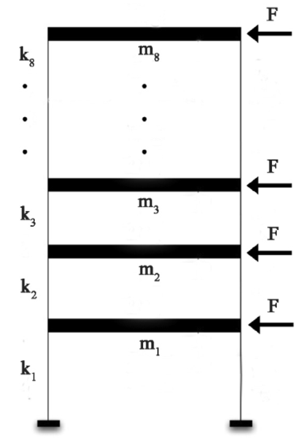

# E6691 Advanced Deep Learning Project - A Generalized Autoencoder for structural damage assessment - Spring 2021
## Data Description
1. For the simulated 8 DOF system, its undamaged condition is characterized by horizontal springs of stiffness ki = 25,000 N/m (i = 1, ..., 8), and each mass is equal to mi = 1 kg (i = 1, ..., 8). The frame is supposed to have modal damping with a damping factor of  = 1% for each of the 8 vibration modes. Total 5 different structural conditions are considered in the analysis including 1 undamaged scenario and 4 different damaged scenarios.

2. The real-bridge dataset is from a case study of Z24 bridge, where the acceleration recordings of 4 sensors (namely termed as Sensor 1, 2, 4, and 5) are considered in this study, which provides a training-set III (fine-turning) that includes two undamaged scenarios with 200 realizations of each, and a testing-set II that includes the two undamaged scenarios with 90 realizations of each, and two damaged scenarios with 128 realizations of each.

## Dependencies
Python libraries needed:
* numpy
* torch
* tensorflow
* pandas
* string
* matplotlib

## Executing program
Please run jupyter notebook:"Sign_Language_MNIST_Competition_Lechen.ipynb"

## Additional information
 
